# Creating a Segmentation Workflow with napari-apoc and OMERO

## Logging into OMERO

Download the [OMERO Insight application](https://www.openmicroscopy.org/omero/downloads/) and install it on your computer. This application allows you to connect to the OMERO server and upload images (the web interface cannot be used to upload images).

Connect to the CMCB VPN if you are not already connected. You can find the instructions for this [here](https://intranet.crt-dresden.de/grav/it_department/faq_howto/remote-connectivity-vpn-sftp-ssh) (internal link, needs ZIH login to be accessed).

Open the OMERO Insight application, click on the wrench icon and add the following server address `omero-int.biotec.tu-dresden.de`. This is the address of the OMERO server you will be using during the course.

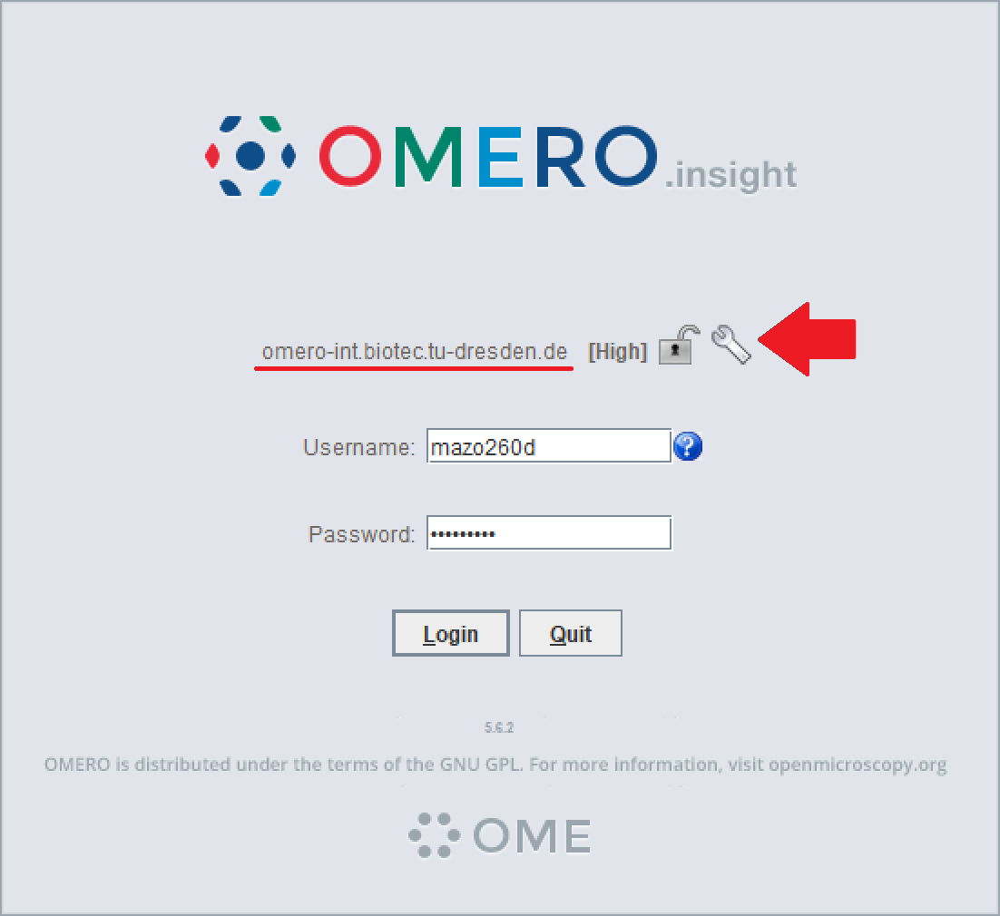

Use your ZIH credentials to log in.

Once you are logged in, you should see the following interface:


Click on "Display Groups" and check the "RegBioMed" group to get access to the images you will be using during the course. On the left pane, you should be able to expand the "RegBioMed" group and see the Project "Segmentation with ML" and 2 Datasets.


## Loading images from OMERO with napari-omero

### Clone the course repository

Clone this repository to your computer by running the following command in the terminal:

```bash
git clone https://github.com/BiAPoL/AMHCT_Bio_Image_Analysis_2025.git
```

or go to https://github.com/BiAPoL/AMHCT_Bio_Image_Analysis_2025 and download the repository as a `.zip` file by clicking on the green "Code" button on the top right of the repository page and selecting "Download ZIP". Remember the place where you decompress the file for the next steps.

### Create the course environment

Open a terminal (preferably Miniforge Prompt, but not necessarily) and run the following command to create the course environment:

```bash
mamba env create -f environment.yml
```

This creates a new environment called `amhct` and installs all the required packages.
Activate the environment:

```bash
mamba activate amhct
```

And start napari:

```bash
napari
```

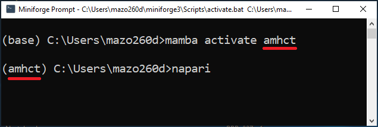

### Loading images from OMERO

In the napari window, go to the menu bar and select `Plugins > napari-omero > OMERO Browser`.


This will open the OMERO Browser panel on the right side of the napari window. Enter your ZIH credentials and the server address `omero-int.biotec.tu-dresden.de` in the OMERO Browser panel. Click on "Connect".


Once you are connected, change the "Group" to "RegBioMed" and set the "User" to "Marcelo Leomil Zoccoler". This will give you access to the images you will be using during the course. You should see the Project "Segmentation with ML".


Expand the Project tree and the "Exercise_DataSet" tree. Click on the image to load it to the napari canvas.

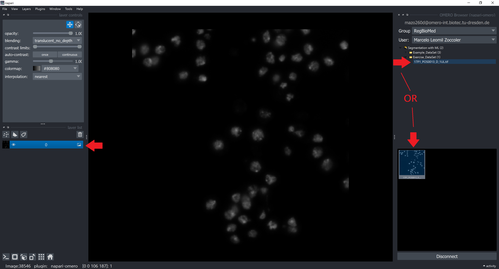

You can close the OMERO Browser panel by clicking on the "X" button on the top left corner of the panel. 


### Handling the Image Dimensions

OMERO always stores images as 5D arrays (X, Y, Z, C, T). Therefore, even if you load a single-channel 2D image, it will be loaded as a 5D array with the dimensions (1, 1, 1, Y, X). But since napari splits channels into different layers, you actually end up with dimensions (1, 1, Y, X) for the image.
You can check the dimensions of the image by clicking on `Tools > Utilities > Layer Details` in the menu bar. This will open a panel with information about the selected layer.


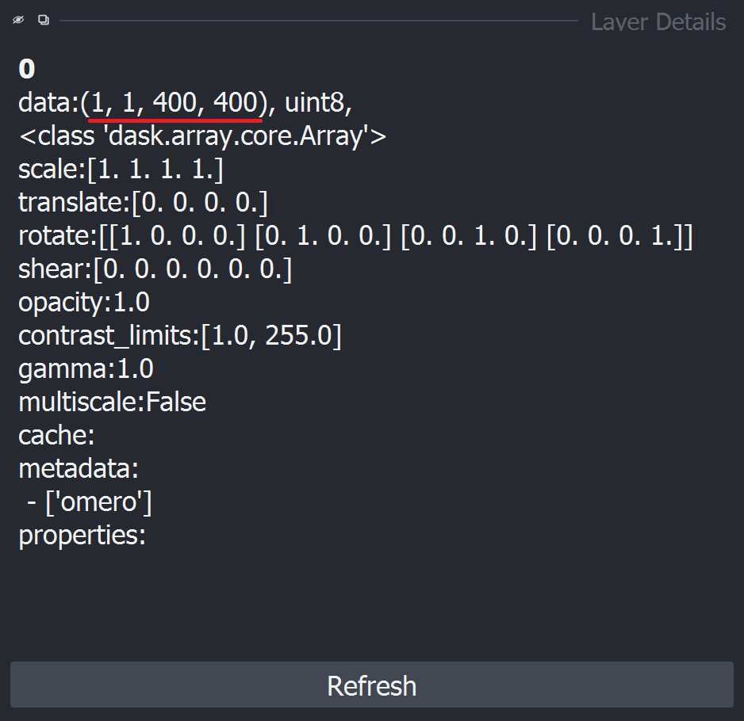

We can and should remove the first two dimensions (1, 1) from the image. To do this, go to `Tools > Transforms > Remove axes of length 1` in the menu bar.


This will open a small widget where you can select the layer to remove the axes from. Select the image layer and click on "Run".


Check the dimensions of the image again by clicking on `Tools > Utilities > Layer Details` in the menu bar. You should see that the dimensions of the image are now (Y, X).

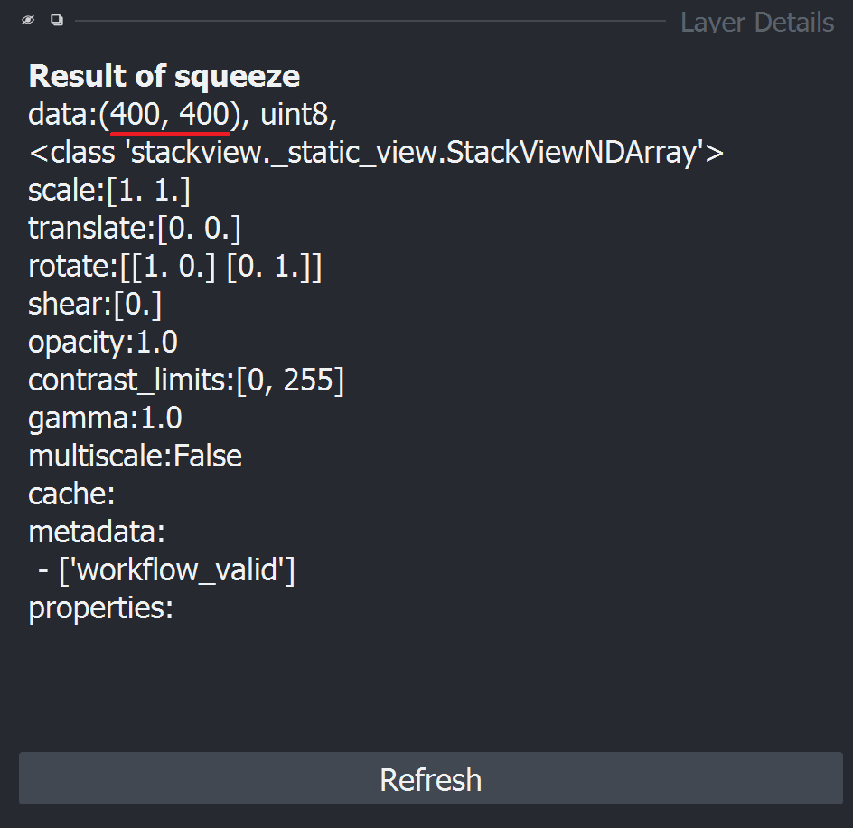

Please delete the original image layer to avoid creating layer with these unit dimensions. To do this, select the image layer and click on the trash can icon on the top right corner of the layer list.

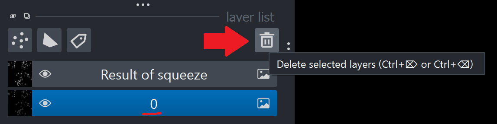

## Object Segmentation with napari-apoc

Use the Object Segmentation from the napari-apoc plugin to segment the image. You should open the Object Segmentation widget via `Tools > Segmentation/labeling > Object Segmentation (APOC)`.

 Check more details on how to do this again in the [Interactive pixel classification and object segmentation in Napari](https://biapol.github.io/AMHCT_Bio_Image_Analysis_2025/interactive_pixel_classification/readme.html) section. 


## Saving Model and Predictions to OMERO

### Saving Layers

To save napari layers locally, select the layer you want to save, then go to `File > Save Selected Layers...`.


### Uploading Images to OMERO

The napari-omero plugin has a fuctionality to upload segmetation results as OMERO ROIs. We will not use this functionality in this course, mainly because the download of ROIs is not available yet, but you can check the plugin documentation for more details.

Instead we will upload the segmentation results as new images. In OMERO Insight, open the Importer by clicking on the Importer icon in the top left corner of the window.

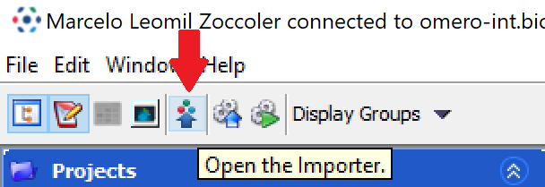

In the Importer window, navigate to the folder where you saved the layers. Select the image files you want to upload and click on the `>` button to prepare them for upload.

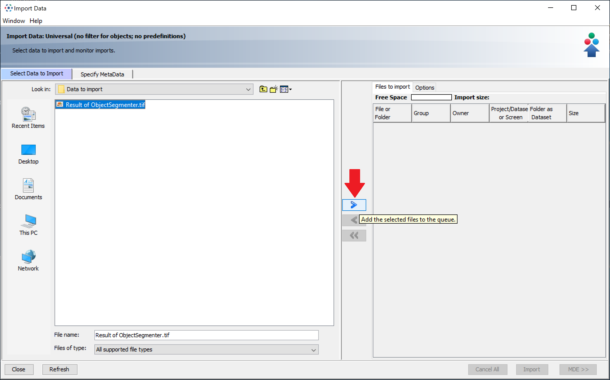

This will pop-up a window where you can select the project and the dataset to upload the images to. Select the "Exercise_DataSet" dataset and click on "Add to the Queue".


This will add the images to the upload queue (right panel). You can add more images to the queue by repeating the previous step. 

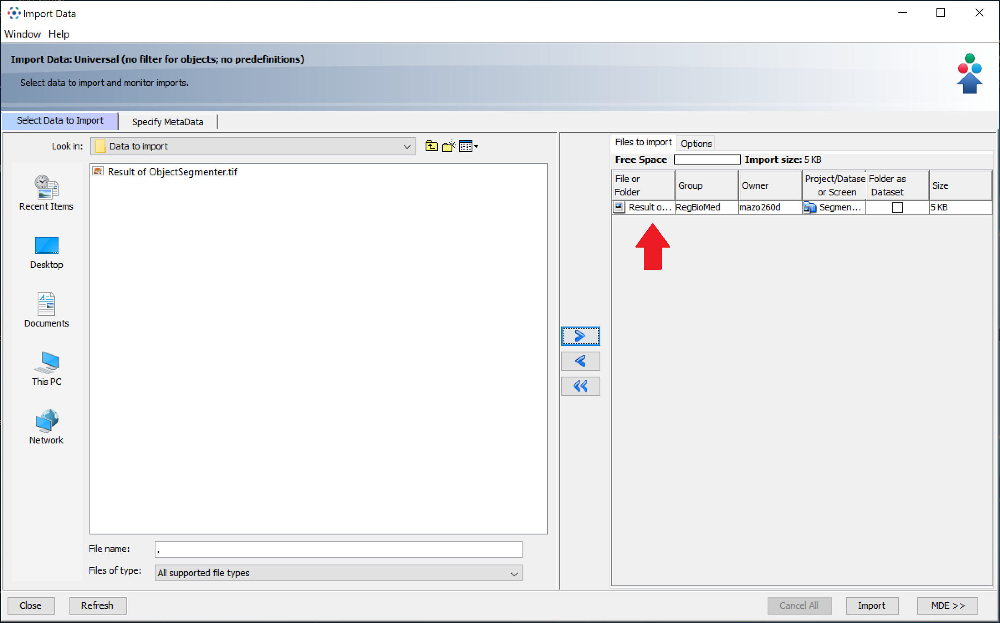

Once you have added all the images you want to upload, click on the "Import" button in the bottom right corner of the Importer window.

Go back to the OMERO Insight main window and click on the refresh button in the top left corner of the window. You should see the images you just uploaded in the "Exercise_DataSet" dataset.


### Annotating Images in OMERO

After selecting an image, you can annotate it with key-value pairs to, for example, indicate the image ID containing the predictions. Below, in the original image, we defined the key "Predictions" and the value "38547", which is the image ID of the predictions we just uploaded.

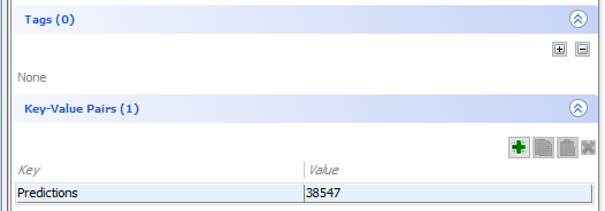

We can also add tags to the image. Tags are useful to group images with similar characteristics so that they can be easily filtered later. For example, we can add the tag "Predictions" to the segmentation image to indicate that it contains predictions. Once we click on the `+` button, we can choose the tag we want to add to the image and click on the `>` button to add it.

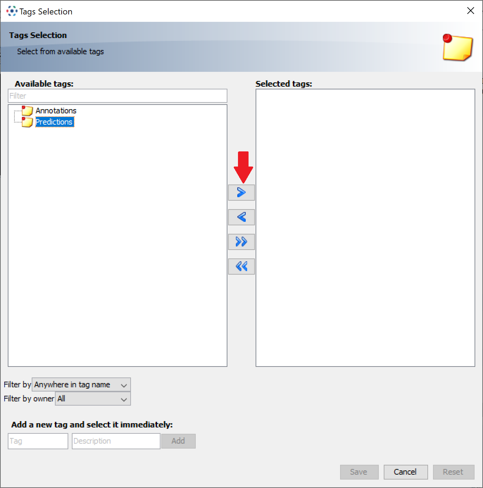 | 

We can filter the images by tags by clicking on "filter images" dropdown box at the top of the OMERO Insight window. This will open a panel where you can select the properties you want to filter by. Select the "Tags" property and write the tag you want to filter by (e.g. "Predictions"). Only images with this tag will be displayed in the OMERO Insight window.


### Saving the Model to OMERO

If we want to save the model we trained in napari-apoc to OMERO, we can do this by uploading the `ObjectSegmenter.cl` file as an attachement to the image. To do this, select the image you want to upload the model to and click on the "Attachments" tab in the right panel. Click on the `+` button to add a new attachment. This will open a file browser where you can select the `ObjectSegmenter.cl` file. Select the file and click on "Open". The file will be uploaded as an attachment to the image.


## Conclusion

This page showed you how to create a segmentation workflow with napari-apoc from images loaded from OMERO and how to store the model and predictions back to OMERO.

## Exercise

Take notes of which information is necessary to make your workflow reproducible adn where you can find it. Share a brief summary of your workflow with a colleague, who will try to reproduce it.

In the next section, we show you one possible way to reproduce the workflow we just created.