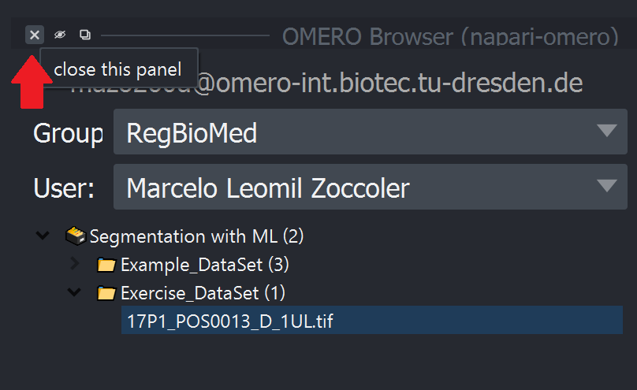

# Creating a Segmentation Workflow with napari-apoc and OMERO

## Logging into OMERO

Download the [OMERO Insight application](https://www.openmicroscopy.org/omero/downloads/) and install it on your computer. This application allows you to connect to the OMERO server and upload images (the web interface cannot be used to upload images).

Connect to the CMCB VPN if you are not already connected. You can find the instructions for this [here](https://intranet.crt-dresden.de/grav/it_department/faq_howto/remote-connectivity-vpn-sftp-ssh) (internal link, needs ZIH login to be accessed).

Open the OMERO Insight application, click on the wrench icon and add the following server address `omero-int.biotec.tu-dresden.de`. This is the address of the OMERO server you will be using during the course.


Use your ZIH credentials to log in.

Once you are logged in, you should see the following interface:


Click on "Display Groups" and check the "RegBioMed" group to get access to the images you will be using during the course. On the left pane, you should be able to expand the "RegBioMed" group and see the Project "Segmentation with ML" and 2 Datasets.


## Loading images from OMERO with napari-omero

### Clone the course repository

Clone this repository to your computer by running the following command in the terminal:

```bash
git clone https://github.com/BiAPoL/AMHCT_Bio_Image_Analysis_2025.git
```

or go to https://github.com/BiAPoL/AMHCT_Bio_Image_Analysis_2025 and download the repository as a `.zip` file by clicking on the green "Code" button on the top right of the repository page and selecting "Download ZIP". Remember the place where you decompress the file for the next steps.

### Create the course environment

Open a terminal (preferably Miniforge Prompt, but not necessarily) and run the following command to create the course environment:

```bash
mamba env create -f environment.yml
```

This creates a new environment called `amhct` and installs all the required packages.
Activate the environment:

```bash
mamba activate amhct
```

And start napari:

```bash
napari
```


### Loading images from OMERO

In the napari window, go to the menu bar and select `Plugins > napari-omero > OMERO Browser`.


This will open the OMERO Browser panel on the right side of the napari window. Enter your ZIH credentials and the server address `omero-int.biotec.tu-dresden.de` in the OMERO Browser panel. Click on "Connect".


Once you are connected, change the "Group" to "RegBioMed" and set the "User" to "Marcelo Leomil Zoccoler". This will give you access to the images you will be using during the course. You should see the Project "Segmentation with ML".


Expand the Project tree and the "Exercise_DataSet" tree. Click on the image to load it to the napari canvas.


You can close the OMERO Browser panel by clicking on the "X" button on the top left corner of the panel. 



OMERO always stores images as 5D arrays (X, Y, Z, C, T). Therefore, even if you load a single-channel 2D image, it will be loaded as a 5D array with the dimensions (1, 1, 1, Y, X). But since napari splits channels into different layers, you actually end up with dimensions (1, 1, Y, X) for the image.
You can check the dimensions of the image by clicking on `Tools > Utilities > Layer Details` in the menu bar. This will open a panel with information about the selected layer.


We can and should remove the first two dimensions (1, 1) from the image. To do this, go to `Tools > Transforms > Remove axes of length 1` in the menu bar.


This will open a small widget where you can select the layer to remove the axes from. Select the image layer and click on "Run".


Check the dimensions of the image again by clicking on `Tools > Utilities > Layer Details` in the menu bar. You should see that the dimensions of the image are now (Y, X).


Please delete the original image layer to avoid creating layer with these unit dimensions. To do this, select the image layer and click on the trash can icon on the top right corner of the layer list.


## Object Segmentation with napari-apoc

Use the Object Segmentation from the napari-apoc plugin to segment the image. Check details on how to do this again in the [Interactive pixel classification and object segmentation in Napari](https://biapol.github.io/AMHCT_Bio_Image_Analysis_2025/interactive_pixel_classification/readme.html) section. 


