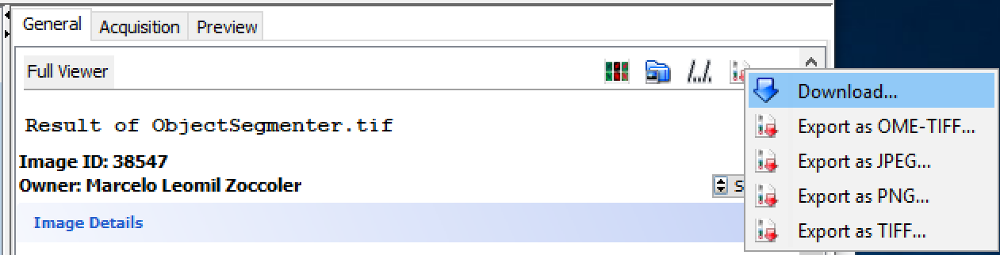
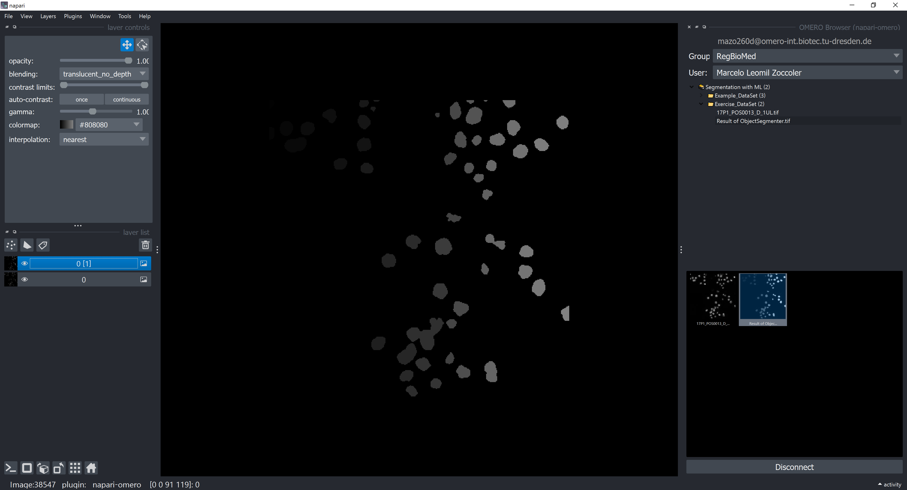
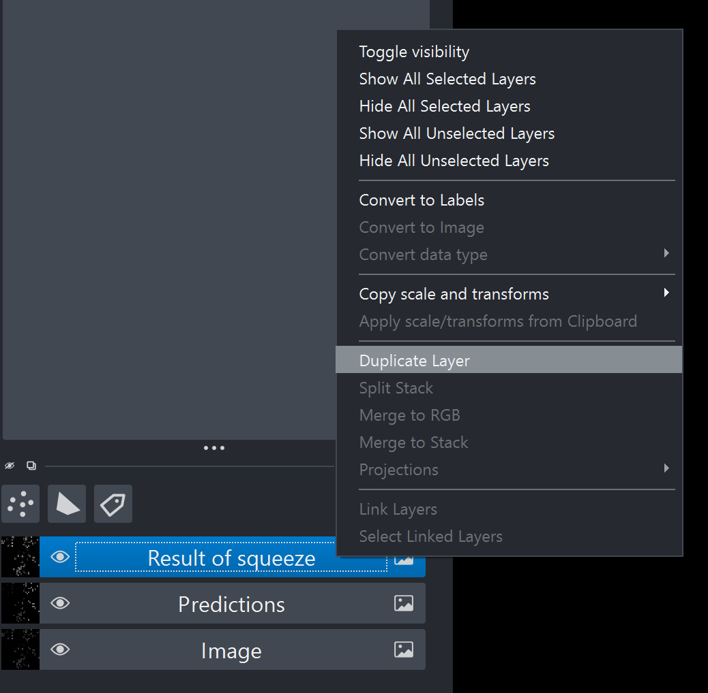
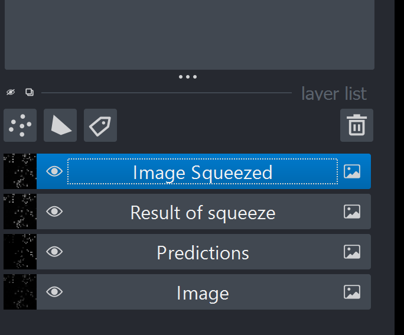
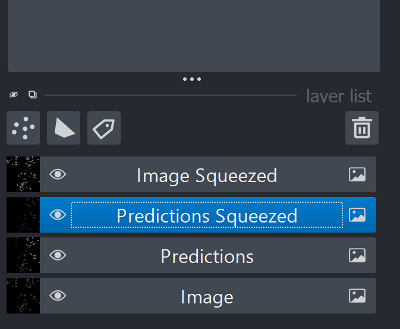
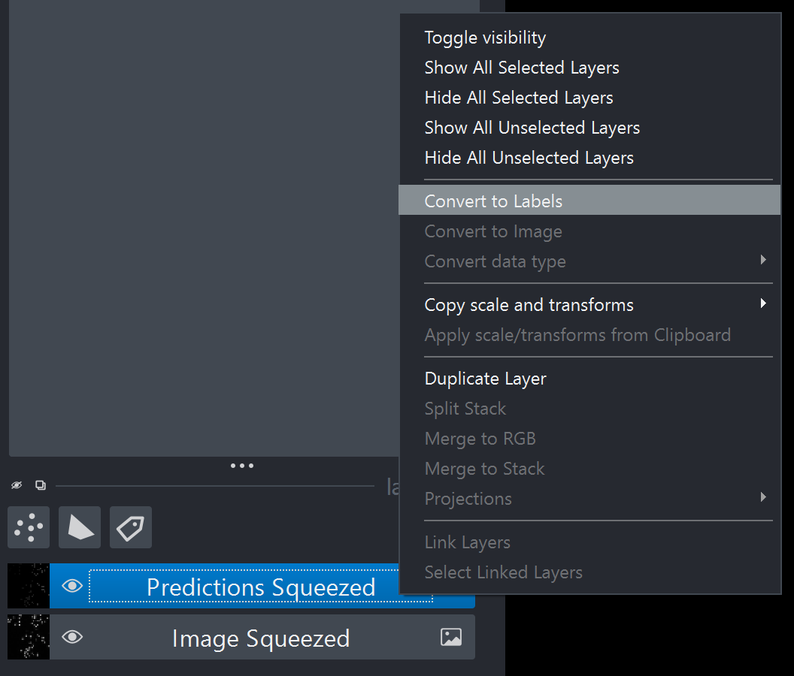
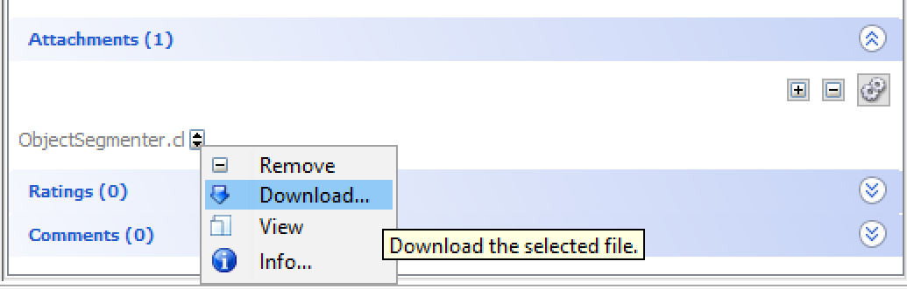
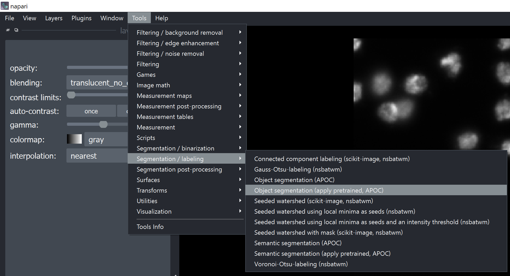

# Reproducing a Segmentation Task Created with napari-apoc and OMERO

In order to reproduce a simple single-image segmentation task, you need access to the following:
- the original image data
- the Machine Learning (ML) model
- the previous segmentation results (predictions), for comparison

Optionally, for completness, you may also want to have access to the  annotations (ground truth) used to train the ML model.

We have shown in the [previous section](https://biapol.github.io/AMHCT_Bio_Image_Analysis_2025/napari_apoc_omero_workflow/workflow_creation.html) how to store the original image data, the predictions and the ML model in OMERO. In this section, we will show how load the data from OMERO and reproduce the segmentation task using the napari-apoc plugin.

## Loading images from OMERO with napari-omero

For small images, you could download the images directly via the Download button in OMERO Insight. For example:

 However, for larger images, it is better to use the napari-omero plugin to load the images directly into napari.

Thus, activate the environment again and start napari:

Open the OMERO Browser panel by going to the menu bar and selecting `Plugins > napari-omero > OMERO Browser`, log in with your ZIH credentials and the server address `omero-int.biotec.tu-dresden.de` again and load both the original image and the predictions to the napari canvas.

### Handling the Image Dimensions

Rename the image layers by double-clicking on the layer name in the napari layer list.

Remove the unitary dimensions from the original image layers (`Tools > Transforms > Remove axes of length 1`), and duplicate the resulting layer by right-clicking on the layer name in the layer list and selecting "Duplicate Layer".

Rename the duplicated layer. Do the same for the predictions layer. You should end up with something like this:

Finally, remove the original image layers (the ones with unitary dimensions) by selecting them and clicking on the trash can icon on the top right corner of the layer list. Conver the predictions layer to a label layer by right-clicking on the layer name in the layer list and selecting "Convert to Labels".

### Loading the ML model

### APOC

