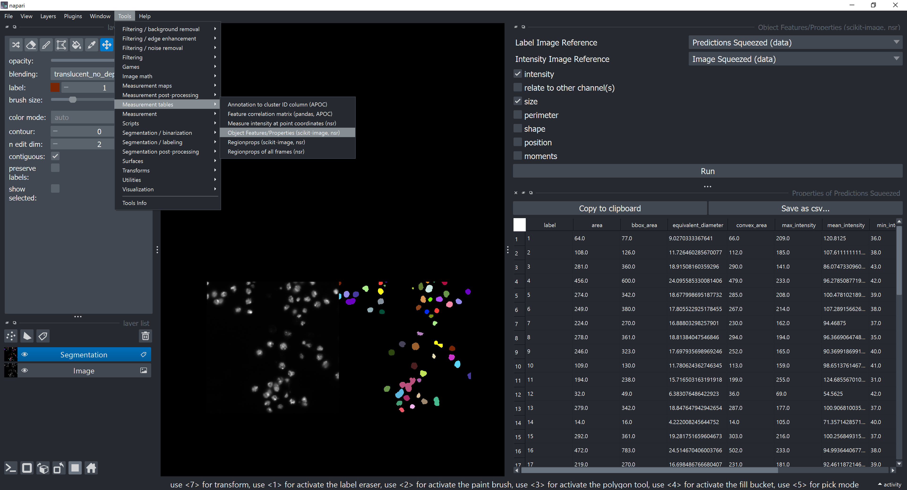
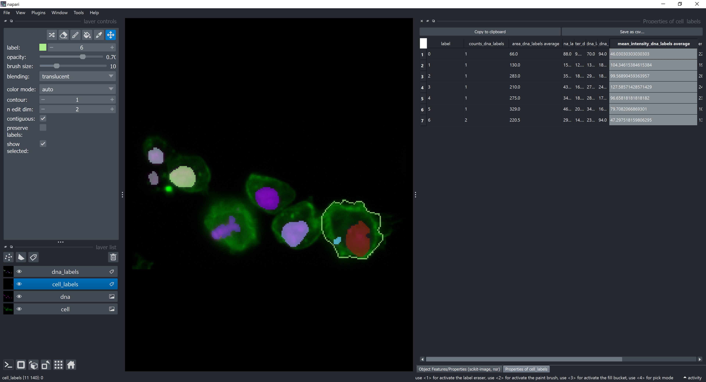

# Feature Extraction with napari-skimage-regionprops

The scikit-image library provides a function to extract region properties from labeled images. This function is used in the napari-skimage-regionprops plugin to extract region properties from images loaded into napari.

The widget can be opened from the Tools menu in napari under `"Tools > Measurement tables > Object features/Properties"`.

The widget allows you to select the image and the labels layer, and then extract region properties such as area (in number of pixels), mean intensity, and centroid coordinates. The extracted properties are displayed in a table format, which can be saved as a CSV file for further analysis.

Also, by selecting the "relate to other channel(s)" option, you can extract region properties from multiple channels and relate them to the a reference labels layer. This allows you to count how many objects from other channels overlap with each region in the reference labels layer. It also allows you to get summary statistics of the properties, for example, the mean intensity of objects in other channels that overlap with each region in the reference labels layer.

In the example below, teh reference labels layer is the one with the cell segmentation. We measured the property "*mean_intensity*" of each "DNA" region (other layer/channel) and calculated the average of this property for each "Cell" region (reference layer). The result is highlighted in the table column  "*mean_intensity*_dna_labels **average**".

